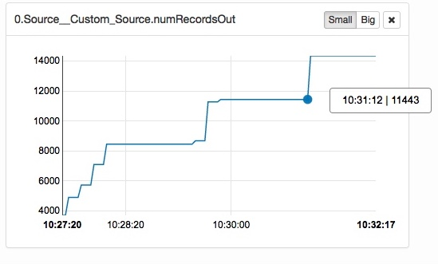
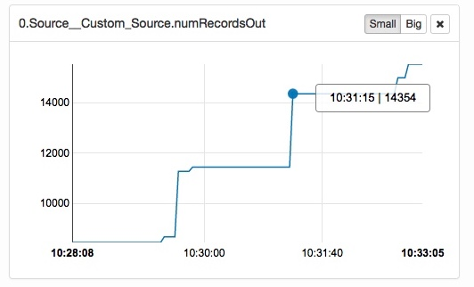

### Locally deployed mosquitto + JMeter

We eliminated 'Bluemix frontdoor' related limits on network transfer rates, so we decided to deploy mosquitto along with JMeter in the same docker container space.

 

#### This time [more is really better](http://www.energy2engage.com/hs-fs/hub/129961/file-296483410-jpeg/images/more_is_better.jpeg?t=1490990984108&width=400&height=300&name=more_is_better.jpeg)

[Real Life: Flink console on Bluemix](http://134.168.58.194:8081/#/overview)

#### Two metrics examples  
(Flink 1.2.0)

Checkpointing on (slow) NFS is responsible to some degree for the staircase appearance, but it turns out the MQTT protocol for QoS 2 takes more blame (checkpointed MQTT messages are acknowledged one by one).
Nevertheless, in the meantime we raised the throughput to ~1000 events per second.

  
While the results in general look satisfying, a container deployment is not suitable for large customers or a multitenant deployment, i.e. multiple customers sharing a single Flink installation - maybe with separate taskmanagers.

[Sizing a Flink deployment](FlyInTheOintment.md)

